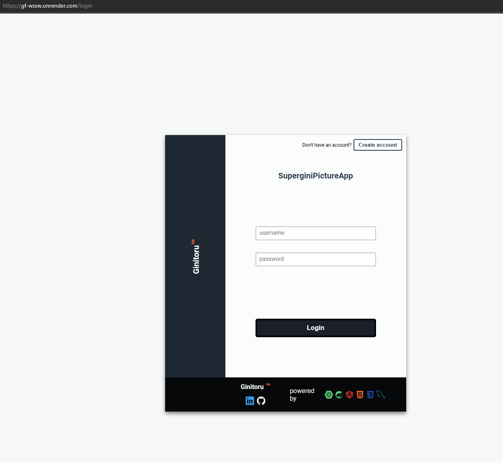

# front-client-p1

1. What does this microservice do:
    - is a front-end interface for a file management app that makes http requests to a back-end microservice -> [logic-core-p1](https://github.com/SuperGini/logic-core-p1) created with spring boot 3

2. Technologies use to create this project:
    - angular 15 - with standalone components
    - HTML
    - CSS

Architecture:
 

 

### front-client-p1 -> in action: the app was deployed for a short time on: https://render.com/

